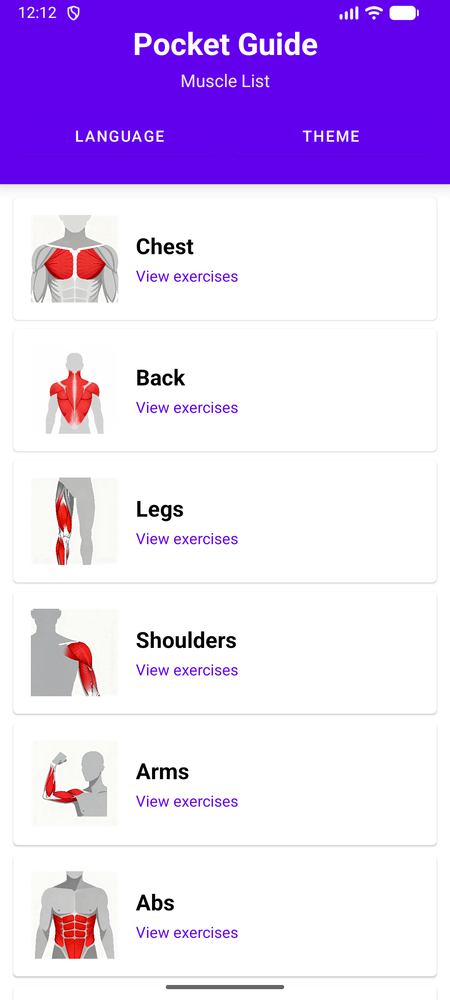
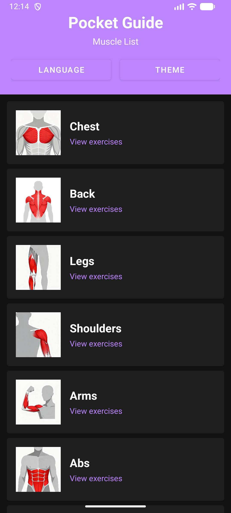
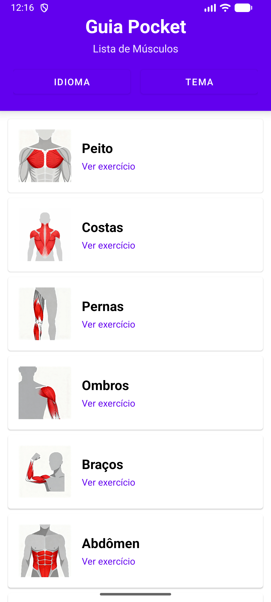
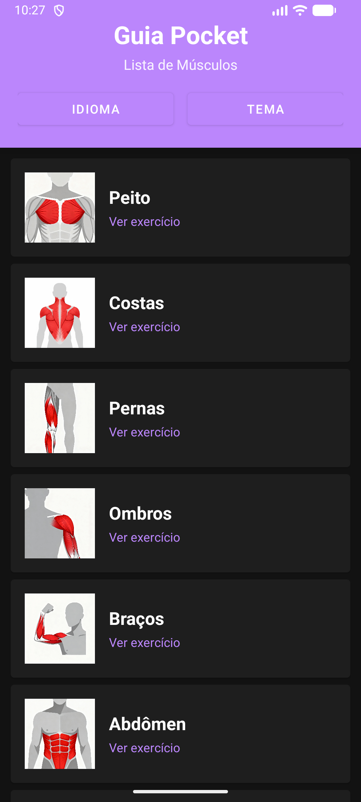

# Pocket Guide 🏋️

Aplicativo de musculação desenvolvido no Android Studio, com informações detalhadas sobre cada exercício, organizados conforme os principais grupos musculares.

## 📋 Descrição

O **Pocket Guide** é um guia de bolso para praticantes de musculação que desejam ter acesso rápido e prático a informações sobre exercícios. O aplicativo organiza os exercícios por grupos musculares, facilitando a consulta durante o treino.

## ✨ Funcionalidades

- 📱 Interface intuitiva e fácil de usar
- 💪 Exercícios organizados por grupos musculares (Peito, Costas, Pernas, Ombros, Braços e Abdômen)
- 🌐 Suporte a múltiplos idiomas (Português e Inglês)
- 🌗 Alternância entre modo claro e escuro
- 🎨 Design moderno e responsivo

## 📸 Screenshots


<h3 align="center">Modo Claro e Escuro</h3>

<div align="center">
  
  
</div>

<br>

<h3 align="center">Suporte a Idiomas</h3>

<div align="center">
  
  
</div>

## 🎥 Demonstração em Vídeo  

[](https://drive.google.com/file/d/1eKzqiugHjrjhbp5X_SiaDdZibj78YzOf/view?usp=sharing)

> 🔗 Clique no botão acima para assistir à demonstração completa do aplicativo.


## 🛠️ Tecnologias Utilizadas

- **Linguagem:** Kotlin
- **IDE:** Android Studio
- **SDK:** Android SDK
- **Arquitetura:** MVVM (Model-View-ViewModel)
- **UI:** Material Design 3

## 📦 Como Executar o Projeto

1. Clone este repositório:
```bash
git clone https://github.com/vitaoh/guia-pocket-app.git
```

2. Abra o projeto no Android Studio

3. Aguarde a sincronização do Gradle

4. Execute o app em um emulador ou dispositivo físico

## 📱 Requisitos do Sistema

- Android 5.0 (API 21) ou superior
- Android Studio Arctic Fox ou superior
- JDK 11 ou superior
